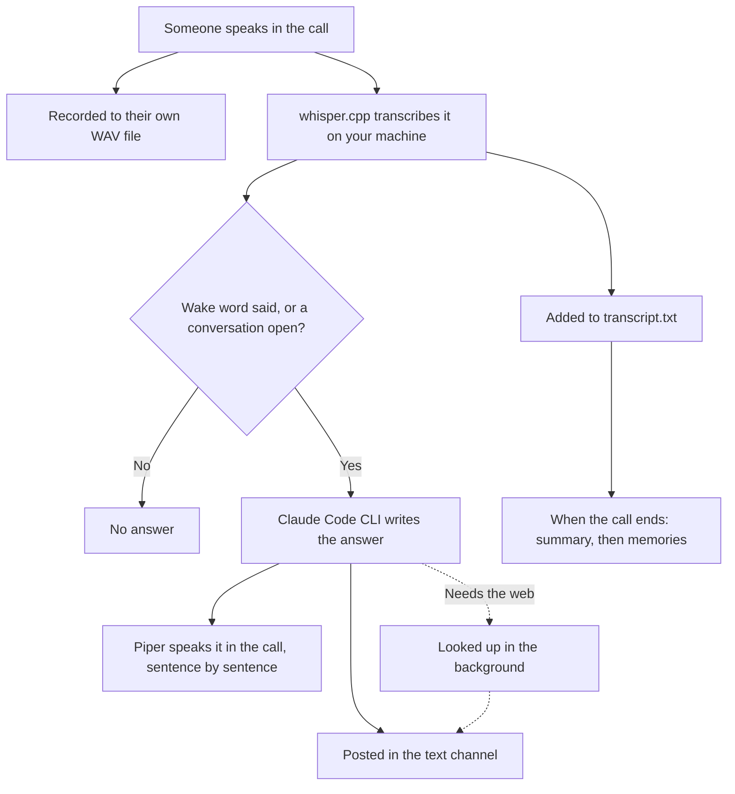
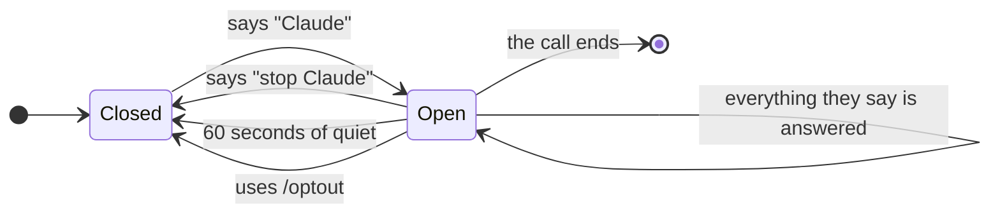
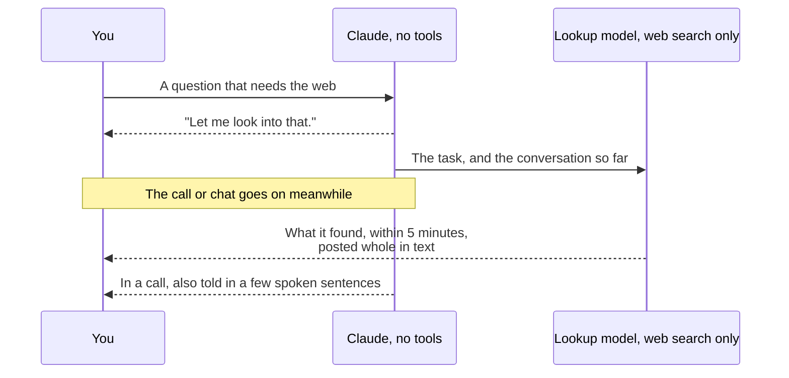
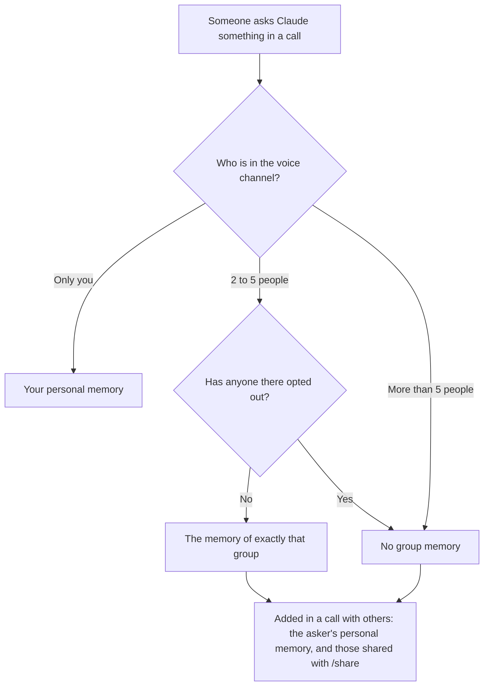

Discord PHP Framework
====

A small framework that makes it easier to start a Discord bot in PHP 8.5: events and slash commands are classes, so `index.php` isn't clogged with `->on` calls.

It includes a voice bot that records calls, lets people talk to Claude out loud, and remembers what was said. Claude runs through the [Claude Code CLI](https://code.claude.com/docs/en/headless), so it uses the Claude subscription you're logged in with instead of an API key. Speech is transcribed and spoken on your own machine, with [whisper.cpp](https://github.com/ggml-org/whisper.cpp) and [Piper](https://github.com/OHF-Voice/piper1-gpl).

## What it does

| Feature | In short | Details |
|---|---|---|
| Voice calls | `/record` joins your voice channel, records it, and answers out loud whoever says "Claude". | [Voice calls](docs/voice-calls.md) |
| Call summaries | When a call ends, Claude posts what was discussed, what was decided, and who does what next. | [When a call ends](docs/voice-calls.md#when-a-call-ends) |
| Lookups | What Claude can't answer well at once is looked up on the web in the background. | [Looking things up](docs/lookups.md) |
| Direct messages | Write to the bot, or send it a voice message, and Claude answers in text. | [Direct messages](docs/direct-messages.md) |
| Memory | The bot keeps a note about each person, and one about each group it has calls with. | [Memory in calls](docs/memory.md) |
| Past calls | `/recall` answers questions from the server's saved calls. | [Asking about past calls](docs/recall.md) |
| Private meetings | `/meet` makes a private voice channel for the people you pick, and records it. | [Private meetings](docs/meetings.md) |
| Opting out | `/optout` stops the bot from recording, transcribing or answering you. | [Opting out](docs/opting-out.md) |
| Settings per server | `/settings` gives a server its own wake word, language, voice and Claude model. | [Settings](docs/configuration.md#settings-for-each-server) |

## Commands

They are registered when `BOT_SLASH_COMMANDS` is set.

| Command | What it does |
|---|---|
| `/record` | Joins your voice channel, records it, and lets everyone in it talk to Claude. |
| `/stop` | Finishes the recordings and leaves the channel. The summary follows. |
| `/meet person:@Spartan` | Makes a private voice channel for you and up to four people, and records it like `/record`. |
| `/recall question:<text>` | Asks Claude about the server's saved calls. Only you see the answer. |
| `/settings` | Shows or changes the server's wake word, language, voice and Claude model. Needs **Manage Server**. |
| `/stats` | Shows how the server has used the bot. |
| `/optout`, `/optin` | Stops the bot from recording, transcribing or answering you, in every server, or lets it again. |
| `/memory` | Shows what the bot remembers about you. `/memory with:@Spartan` shows a group's memory. |
| `/forget` | Deletes what the bot remembers about you. `/forget with:@Spartan` deletes a group's memory. |
| `/share`, `/unshare` | Lets the bot use your personal memory for everyone in the call, until the call ends, or takes it back. |
| `/privacy` | Shows or changes when the bot may use your personal memory in calls with other people. |

`/optout`, `/optin`, `/memory`, `/forget`, `/privacy` and `/unshare` also work in a direct message with the bot.

## Voice calls with Claude

`/record` joins your voice channel, records it, and lets everyone in it talk to Claude. The call ends with `/stop`, when someone says "disconnect Claude", when someone disconnects the bot, or when the bot is stopped.



- **Recordings.** Each speaker gets their own WAV file in `recordings/<server id>/<date>/`, next to a `transcript.txt` of the call and, once it ends, its `summary.md`.
- **Wake word.** Saying "Claude" opens a conversation for whoever said it, so there is no need to say it in every sentence. Other people open their own.
- **Answers** are spoken while Claude is still writing them, and posted in the text channel once whole.
- **Interrupting.** The bot stops speaking when the person it is answering starts talking.
- **Leaving by voice.** Anyone in the call can say "disconnect Claude": the bot says "Okay.", then stops recording and leaves, as `/stop` does. "Disconnect" alone doesn't count.
- **Summary.** When the call ends, Claude summarizes its whole transcript in the text channel where `/record` was used.
- **When something fails.** What can't be transcribed, answered or spoken is said in the text channel, and the call hears "Sorry, something went wrong.", once for each thing that fails. The call goes on.

A conversation belongs to one person:



More in [docs/voice-calls.md](docs/voice-calls.md): conversations, interruptions, pauses, retention, how Claude Code and Piper are kept running during a call, and how to speak with Kokoro instead of Piper.

## Looking things up

Claude answers at once, without tools, so the call isn't kept waiting. A question that can't be answered well that way (the latest version of something, tomorrow's weather) is handed off and looked up in the background, in calls and in direct messages.



- The model that looks things up (`CLAUDE_LOOKUP_MODEL`, `sonnet` by default) can search the web and do nothing else. For a task Claude hands off as hard (`LOOK UP: [hard] ...`) it must consult an advisor (`CLAUDE_LOOKUP_ADVISOR`, `opus` by default); any other task is looked up without one.
- It gets the task Claude wrote and the call's transcript, or the DM's last 100 messages. It is never given the memories the bot keeps of people.
- One task is looked up at a time in each call and each chat, up to 3 more wait their turn, and no more than `CLAUDE_LOOKUP_AT_ONCE` (2 by default) are looked up at once in all of them together.
- A lookup nobody wants any more (whoever asked opted out, or a memory it was made from was taken back or erased with `/forget`) is stopped, not left to finish. Someone joining who it was not made for only drops what waits for its turn or is found, if they are still there then.

> [!IMPORTANT]
> Once something is looked up, what was said in the call, or written in the DM, is given to a model that searches the web, so its search queries can hold parts of it, including what Claude said there from a memory.

More in [docs/lookups.md](docs/lookups.md).

## Direct messages and memory

Send the bot a direct message, and Claude answers it there, in text, as your personal assistant.

- Each answer is made from what the bot remembers about you and from the DM's last 20 messages.
- A Discord voice message of up to 5 minutes works too: it is transcribed on your machine, and the answer starts with a quote of what the bot heard.
- **The memory** is a markdown note of under 4,000 characters that Claude writes about each person, at `MEMORY_PATH/<user id>.md`. It is updated ten minutes after your last message.
- `/memory` shows you what the bot remembers about you, and `/forget` deletes it.
- Messages in servers and messages from other bots are never answered.

More in [docs/direct-messages.md](docs/direct-messages.md).

## Memory in calls

The bot keeps your **personal memory** (the one of your DMs) and a separate **group memory** for each group of people it has calls with. Which one a call uses depends on who is in the voice channel. Bots don't count; everyone else does, not only the people who spoke.



- A group's memory belongs to exactly the people in the channel: you and Spartan have one; you, Spartan and Carol have another.
- Personal memories are never updated from calls with other people: what Spartan says there goes into the group's memory, never into yours.
- Your personal memory is added to your own questions, even with others listening. `/privacy personal_memory_in_calls:only after /share` keeps it out of calls with others until you share it.
- `/share` lets the bot use your personal memory to answer anyone in the call, until the call ends. `/unshare` takes it back.
- An answer made from a group memory is cut off when someone joins who that memory doesn't belong to.
- Anyone in a group can see its memory with `/memory with:@Spartan` and delete it with `/forget with:@Spartan`.

More in [docs/memory.md](docs/memory.md).

## Privacy and safety

> [!IMPORTANT]
> Only record people who have agreed to it. The bot announces in the channel when it starts recording, and anyone who doesn't want to be recorded can use `/optout`.

- **Opting out.** After `/optout`, no recording of you is kept, what you say isn't transcribed or sent to Claude, and Claude doesn't answer you, in every server. Discord still sends the bot your audio: the voice library holds it in memory and in a temporary file until the call ends, and the bot keeps none of it. `/optin` undoes it. See [docs/opting-out.md](docs/opting-out.md).
- **What Claude can do.** Claude runs with every tool disabled, no MCP servers and from an empty directory, so nothing said can make it read or change anything on your computer. The one exception is the model that looks things up, which can search the web and do nothing else.
- **Where things are kept.** Recordings, transcripts, summaries and memories stay on the bot's machine, where anyone with access to the machine can read them. Memory files can only be read by the user the bot runs as (mode 0600). Recordings are kept until you delete them, unless `RECORDINGS_RETENTION_DAYS` is set.
- **Who can use it.** Anyone in the server can use `/record`, `/meet` and `/recall`, and so ask about any call saved in the server. Server admins can restrict a command to some roles, members or channels under Server Settings → Integrations. Anyone who shares a server with the bot can send it direct messages.
- **Private meetings.** Claude's answers and the summary of a `/meet` call are posted in the channel where `/meet` was used, so use it in a channel only the people in the meeting can read. Server admins and the server's owner see every channel.
- **Usage.** Answers, summaries, lookups and memory updates count against your Claude subscription's usage limits.

## Setup on Windows (WSL2)

The voice library doesn't support native Windows, so run the bot inside WSL2 (these steps use Ubuntu 24.04). Keep the project in the Linux filesystem, e.g. `~/discord-bot`, not under `/mnt/c`.

1. Install PHP 8.5 and the system packages. `ext-ffi`, which voice needs, comes with `php8.5-common` and is enabled for the CLI by default. Then install [Composer](https://getcomposer.org/download/).

    ```bash
    sudo add-apt-repository ppa:ondrej/php
    sudo apt update
    sudo apt install php8.5-cli php8.5-mbstring php8.5-xml php8.5-curl php8.5-zip php8.5-sqlite3 \
        ffmpeg libopus0 unzip git curl cmake build-essential python3-venv
    ```

2. Install the bot's dependencies and libdave, Discord's end-to-end voice encryption, which every voice connection has required since March 2026. Run the script from the project folder: it installs into `.cache/libdave`, where the bot finds it automatically.

    ```bash
    cd ~/discord-bot
    composer install
    bash vendor/discord-php-helpers/voice/scripts/setup-libdave.sh
    ```

3. Build whisper.cpp and download a model. `base` handles every language; `small` is more accurate but slower.

    ```bash
    git clone https://github.com/ggml-org/whisper.cpp ~/whisper.cpp
    cd ~/whisper.cpp
    cmake -B build -DCMAKE_BUILD_TYPE=Release
    cmake --build build -j --config Release --target whisper-cli whisper-server
    sh ./models/download-ggml-model.sh base
    ```

4. Install Piper and a voice. Pick a voice in your language from the [voice list](https://huggingface.co/rhasspy/piper-voices), e.g. `pt_BR-faber-medium` for Brazilian Portuguese.

    ```bash
    python3 -m venv ~/piper
    ~/piper/bin/pip install piper-tts
    ~/piper/bin/python -m piper.download_voices --download-dir ~/piper/voices en_US-lessac-medium
    ```

5. Install Claude Code, run it once and log in with your Claude Pro or Max account. The bot turns off Claude Code's auto-update, so run `claude` yourself now and then to update it.

    ```bash
    curl -fsSL https://claude.ai/install.sh | bash
    claude
    ```

6. In the [Discord Developer Portal](https://discord.com/developers/applications), enable the bot's **Server Members Intent**, then invite it with the `bot` and `applications.commands` scopes and the View Channels, Send Messages, Connect, Speak and Manage Channels permissions. Manage Channels is only needed for `/meet`.

7. Copy `.env-local` to `.env`, fill in your bot token and the paths from the steps above, and start the bot:

    ```bash
    cp .env-local .env
    composer serve
    ```

## Stopping the bot, and when something fails

- **Ctrl+C, or `kill`,** stops the bot the way `/stop` stops a call: it leaves every voice channel at once, ends the meetings made with `/meet`, and ends by itself once every call is summarized and its memories are updated. Ctrl+C a second time ends it without waiting for that.
- **An error doesn't take the bot down.** What fails is logged with what called what, never with what was said, and the bot goes on. A slash command that failed tells whoever used it. Only when errors keep coming, ten within ten seconds, does the bot tell its calls, leave them and end, with exit code 1.
- **Nothing starts the bot again** once it has ended. Run it under a loop, or as a systemd service, that looks at its exit code: 0 when you stopped it.

More in [docs/stopping-and-errors.md](docs/stopping-and-errors.md): what is waited for, the exit codes, and a systemd unit.

## Configuration

Set these in `.env`. The notes and measurements behind each one are in [docs/configuration.md](docs/configuration.md).

| Variable | Default | |
|---|---|---|
| `BOT_SLASH_COMMANDS` | | Must be set for the slash commands to be registered. |
| `BOT_REMOVE_OLD_COMMANDS` | | Set it to `true` to remove, when the bot starts, the global commands Discord has for the application and the bot has no class for. Otherwise they are only named in a warning. |
| `RECORDINGS_PATH` | `recordings` | Where recordings, transcripts and summaries are saved. |
| `RECORDINGS_RETENTION_DAYS` | | Calls older than this many days are deleted. Leave it empty to keep everything. |
| `VOICE_WAKE_WORD` | `claude, claud` | Claude only answers what mentions it. List the spellings whisper writes for your voice, separated by commas: `claude, cloud, claud`. With `cloud` in the list, the bot also answers when people talk about the cloud, which is why the default has `claud` and not `cloud`. Leave it empty to answer everything. |
| `VOICE_STOP_PHRASE` | `stop <wake word>` | What closes the conversation of whoever says it. |
| `VOICE_LEAVE_PHRASE` | `disconnect <wake word>` | What ends the call when anyone in it says it. |
| `VOICE_PAUSE_SECONDS` | `0.6` | How long someone has to be silent for what they said to be over. |
| `VOICE_PLAYER` | `bot` | Who sends the bot's speech to Discord: the bot itself (`bot`), as soon as each sentence is ready, or the voice library (`library`), which waits half a second before every sentence. |
| `WHISPER_BINARY` | `whisper-cli` | Path to whisper.cpp's `whisper-cli`. |
| `WHISPER_SERVER_BINARY` | `whisper-server` next to `WHISPER_BINARY`, if it is there | Path to whisper.cpp's `whisper-server`, which a call keeps running with the model loaded: with a GPU, a short question is transcribed in about 0.1 to 0.3 s instead of the 0.5 to 0.9 s that starting `whisper-cli` takes. It has no password, so leave it empty on a machine shared with people you don't trust. |
| `WHISPER_MODEL` | | Path to the whisper model, e.g. `~/whisper.cpp/models/ggml-base.bin`. |
| `WHISPER_LANGUAGE` | `auto` | Language spoken in the call, e.g. `en` or `pt`. `auto` detects it, which takes a second or two longer: set it when one language is spoken. |
| `WHISPER_THREADS` | | How many threads whisper uses. Empty leaves it to whisper, which takes 4. |
| `WHISPER_PROMPT` | | Text whisper takes as what was said just before. It helps whisper write the wake word as it is. |
| `CLAUDE_BINARY` | `claude` | Path to the Claude Code CLI. |
| `CLAUDE_MODEL` | `haiku` | `haiku` answers fastest; `sonnet` or `opus` answer better, but slower. |
| `CLAUDE_LOOKUP_MODEL` | `sonnet` | The model that looks things up in the background. |
| `CLAUDE_LOOKUP_ADVISOR` | `opus` | The model it must consult for a hard task. Leave it empty for no advisor. |
| `CLAUDE_LOOKUP_AT_ONCE` | `2` | How many tasks are looked up at once, in all calls and chats together. |
| `PIPER_BINARY` | `piper` | Path to Piper. |
| `PIPER_MODEL` | | Path to the Piper voice, e.g. `~/piper/voices/en_US-lessac-medium.onnx`. |
| `FFMPEG_BINARY` | `ffmpeg` | Path to ffmpeg, which converts Piper's speech for Discord, and the voice messages sent in DMs for whisper.cpp. |
| `STATS_DATABASE` | `databases/stats.sqlite` | SQLite database for the statistics, the settings, and who opted out. It is created on the first start. |
| `MEMORY_PATH` | `memories` | Where the bot keeps what it remembers about each person and each group. |

`VOICE_WAKE_WORD`, `WHISPER_LANGUAGE`, `PIPER_MODEL` and `CLAUDE_MODEL` are the defaults for every server the bot is in. Each server can change its own with [`/settings`](docs/configuration.md#settings-for-each-server).

## Logs and statistics

Neither the logs nor the statistics contain what anyone said or what Claude answered.

- **Logs** are printed to the console and written to `logs/<date>.log`, one JSON object per line. Each step of a call is logged with the server, the call's `session` ID, the `user` it concerns, and how long it took.
- **Statistics** are kept in `STATS_DATABASE`, one row per event. `/stats` shows a server its totals.

```bash
# Everything that happened in one call
jq -c 'select(.context.session == "1a2b3c4d") | [.datetime, .message, .context]' logs/2026-10-03.log
```

Every log message, and more queries, in [docs/logs-and-statistics.md](docs/logs-and-statistics.md).

## Known limitations

- The bot starts on its answer about two seconds after a short question, as measured on a 10-core desktop CPU with whisper `base`, `WHISPER_LANGUAGE=en`, 8 threads and `CLAUDE_MODEL=haiku`; the whisper server, with a GPU, takes about half a second off that, and the bot sending its speech itself (`VOICE_PLAYER=bot`) another half second. With the default `auto` language it takes a second or two longer.
- Only the person the bot is answering can interrupt it.
- Speech recognition sometimes mishears the wake word ("cloud" for "Claude"). The default wake word already has "Claud", which whisper also writes for it. List the spellings whisper writes for your voice in `VOICE_WAKE_WORD` or `/settings`.
- The stop phrase and the leave phrase wait their turn behind what was said before them: a sentence is only known once it is transcribed, and sentences are handled one at a time.
- The voice library keeps every decoded audio frame in memory until `/stop`, roughly 12 MB per speaker per minute of speech. For very long calls, `/stop` and `/record` again now and then.
- Discord lets a bot be in one voice channel per server, and doesn't let bots join the calls of direct messages: use `/meet` for a private call.
- The bot only remembers its meetings while it runs. Stopped with Ctrl+C or a signal, it ends them and deletes their channels. When it ends another way during a meeting made with `/meet`, the meeting's channel stays: delete it by hand.
- A bot that ends without being stopped (out of memory, `kill -9`, the machine going down) can't leave its calls: it stays in the voice channel until Discord notices, and the calls aren't summarized.

The whole list is in [docs/voice-calls.md](docs/voice-calls.md#known-limitations).

## Development

- **Events.** A class in `app/Events` named after a Discord event, such as `MessageCreate`, and extending `App\EventAbstract` handles that event. Its functions run one after the other, until one returns `true`.
- **Slash commands.** A class in `app/Commands/Global` named `<Name>Command` and extending `App\CommandAbstract` is registered as `/<name>`. Global commands Discord has that the bot has no class for are named in a warning when it starts, and only removed when `BOT_REMOVE_OLD_COMMANDS` is set. A command that throws, or whose promise is rejected, tells whoever used it that it failed, and is logged with its name.

```bash
composer test                          # unit and feature tests
composer test -- --testsuite Unit      # or Feature
composer test:coverage                 # needs pcov or Xdebug
composer bench                         # times a question with the real whisper.cpp, Claude Code and Piper
composer pint                          # fixes the code style
```

The feature tests replace whisper.cpp, Claude Code, Piper and, for voice messages, ffmpeg with the scripts in `tests/Fixtures`, so they need no models, Claude login or Discord connection. `VoiceCallTest` uses the real ffmpeg and libopus, and is skipped without them. Examples, and how the tests work, in [docs/development.md](docs/development.md).

The tests can't tell whether the bot got slower: `composer bench` asks it a spoken question with the real programs of your machine and fails when the answer comes clearly later than it did on `master`. Run it before merging something that could slow the bot down: see [the benchmark](docs/development.md#benchmark).

### Live voice test

`tests/Live` asks the bot a question in a real Discord voice call, with a second bot as the speaker. It runs in GitHub Actions every night, on demand, and on pull requests that change the bot. It needs its own private Discord server and two bot applications that nothing else uses: see [docs/development.md](docs/development.md#live-voice-test).

## Contributing

We are open to contributions.
